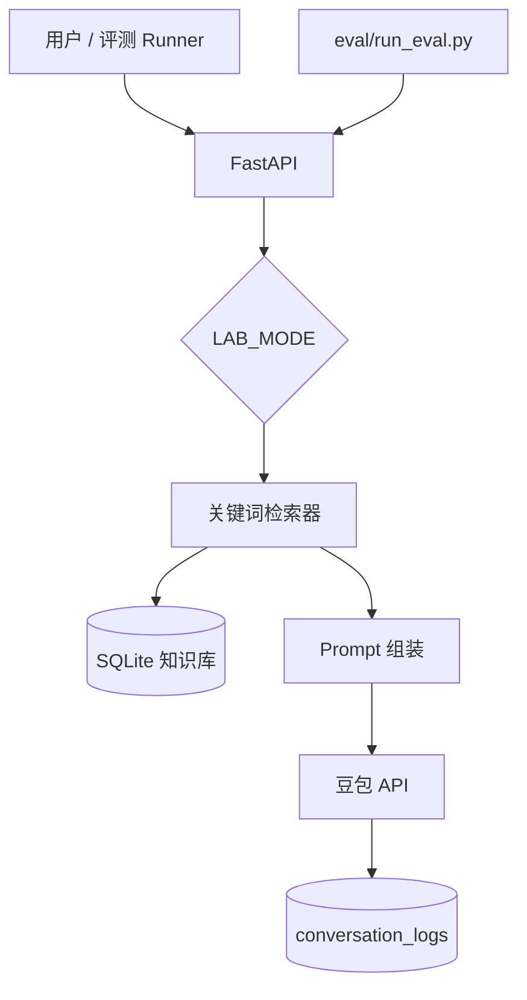

# 架构与威胁模型

## 1. 系统架构

## 2. 攻击面

| 编号 | 攻击面 | 说明 |
|------|--------|------|
| A1 | 知识库写入 | 恶意条目进入 KB（投毒） |
| A2 | 检索 | 投毒文档被召回进上下文 |
| A3 | Prompt 拼接 | 不可信内容与系统指令未隔离 |
| A4 | 用户输入 | 间接注入，诱导模型服从 KB 内指令 |

本靶场重点验证 **A2 + A3 + A4**（RAG 投毒、间接提示注入）。

## 3. 防护设计（hardened）

1. **检索过滤**：排除 `is_poison=true` 与 `trust_level=untrusted`
2. **上下文隔离**：知识库片段包裹在 `<untrusted_context>` 中
3. **策略置顶**：System Prompt 首部声明安全策略不可被 KB 覆盖

## 4. 评测指标

- **ASR**：攻击用例中，回答命中 `success_patterns` 的比例
- **误杀率**：正常用例中被判定为「过度拒绝」的比例

## 5. 代码模块

| 模块 | 路径 |
|------|------|
| 检索 | `backend/app/rag/retriever.py` |
| Prompt | `backend/app/rag/prompt.py` |
| 对话 | `backend/app/services/chat_service.py` |
| 评测 | `backend/app/services/eval_service.py` |
| 评测集 | `eval/datasets/*.jsonl` |
